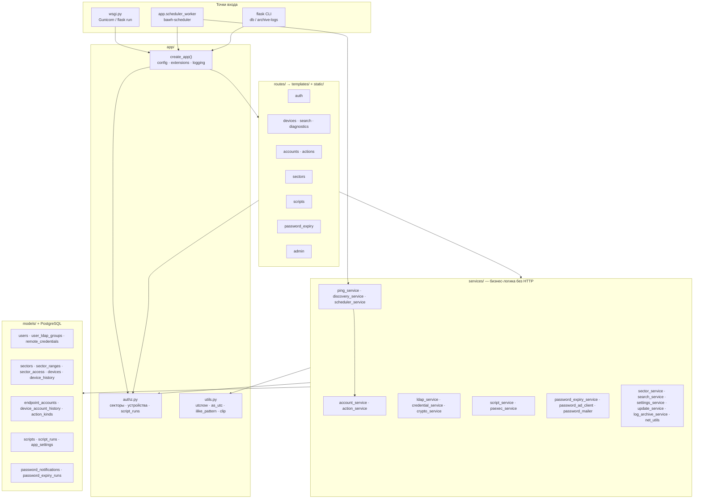
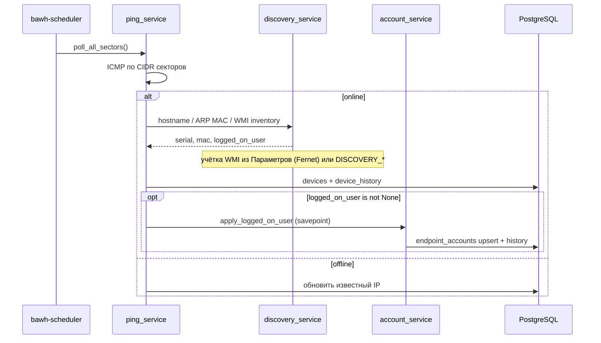

# Архитектура bAWH

Краткий граф для навигации по коду. Детали установки — в [README.md](../README.md).

## Слои



## Поток опроса



## Справочники и журналы

| Сущность | Таблица | Кто пишет | Кто читает |
| --- | --- | --- | --- |
| Оператор сайта | `users` | `ldap_service` | auth, authz |
| УЗ на ПК | `endpoint_accounts` | `account_service` | `/accounts`, карточка устройства |
| Появление УЗ | `device_account_history` | `account_service` | лента `/actions`, вкладка accounts |
| Типы действий | `action_kinds` | миграция / `seed_action_kinds` | `/actions` |
| Запуски | `script_runs` | `script_service` | `/scripts/runs`, лента `/actions` |
| Опросы | `device_history` | `ping_service` | вкладка polls |

Правила видимости — только в `app/authz.py`:

- `accessible_sector_ids` / `user_can_access_device`
- `user_can_see_script_run` — админ, автор, или доступное устройство (orphan без автора скрыт)

## Ключевые соглашения

- **Маршрут** не пингует и не ходит в LDAP — только форма → сервис → шаблон.
- **Домен УЗ** хранится как NetBIOS upper-case (первая метка DNS/UPN): `CORP\alice` и `alice@corp.local` — одна запись.
- **WMI UserName**: `None` в probe — WMI не вызывали/упал (текущую УЗ не трогаем); `""` — никто не залогинен.
- **ILIKE**: экранирование через `utils.ilike_pattern`.
- **Время**: `utils.utcnow` / `as_utc` — всегда timezone-aware UTC.

## Каталоги

```
bAWH/
  VERSION · wsgi.py · requirements.txt
  app/
    __init__.py · config.py · extensions.py · authz.py · utils.py
    models/ · services/ · routes/ · templates/ · static/
  migrations/versions/   # Alembic, сейчас до 0006_password_expiry
  tests/
  deploy/                # Debian 12: systemd, Nginx, install script
  docs/ARCHITECTURE.md   # этот файл
```
