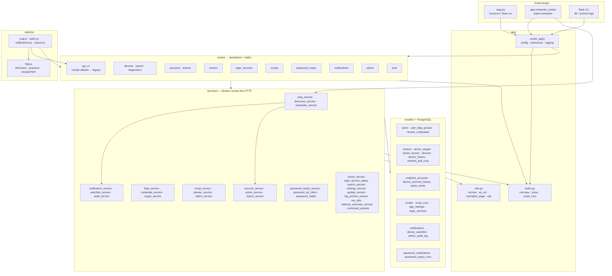
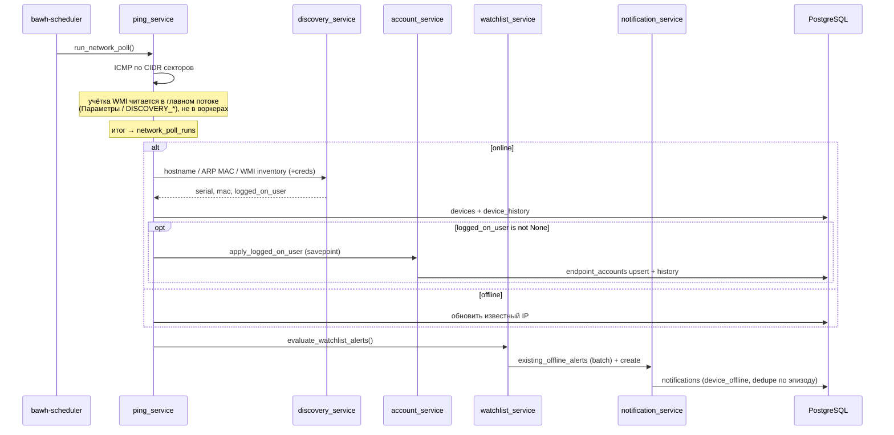
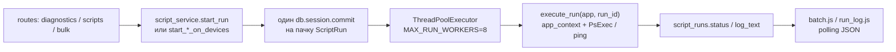

# Архитектура bAWH

Краткий граф для навигации по коду. Детали установки — в [README.md](../README.md). План развития — в [ROADMAP.md](ROADMAP.md). Текущий релиз: **v0.6.0** (волны W1–W4 + simplify [#32](https://github.com/blazerity/admin-webhelper/pull/32)).

## Слои



## Поток опроса



## Очередь запусков (ping / script / command)



Bulk ping/script пишут все `pending`-строки одним commit и ставят `execute_run` в общую очередь (`enqueue_run`). Отдельный daemon-поток на каждый run больше не создаётся. При перезапуске процесса незавершённые runs остаются в БД; повторный enqueue — вручную или следующим action (Celery — точка расширения).

## Authz v2

Правила видимости — только в `app/authz.py` (ADR: [002-authz-v2.md](adr/002-authz-v2.md)):

| Проверка | Смысл |
| --- | --- |
| `accessible_sector_ids` / `user_can_access_device` | секторный ACL; устройство без `sector_id` недоступно non-admin |
| `user_can_see_script_run` | админ, автор run, или доступное устройство |
| `filter_accessible_devices` | bulk: один ACL-запрос секторов на пачку id |
| `user_can_run_diagnostics` | admin / operator; чистый viewer — нет; legacy user без ролей — да |
| `user_can_run_scripts` / `user_can_run_script` | admin / operator; non-admin — только `is_published` |
| `user_can_view_password_expiry` | admin / password_viewer |

Роли additive поверх `is_admin` + `sector_access`. Bulk-маршруты вызывают `user_can_run_diagnostics` / `user_can_run_scripts` напрямую (алиасы `user_can_bulk_*` удалены в #32).

## Внутренний API v1

Blueprint `app/routes/api_v1.py` (`/api/v1/...`) — тонкие aliases: делегирует в legacy JSON-handlers (`devices`, `notifications`, `search`). Старые пути (`/api/map/status`, `/api/batches/...`, `/search/suggest`, …) не удаляются. Контракт — session cookie + CSRF как у UI.

Общий фронтенд-клиент: `app/static/js/http.js` (`window.BawhHttp`) — `fetchJson` / `postJson` / `escapeHtml` для map, batch, notifications, search.

## Справочники и журналы

| Сущность | Таблица | Кто пишет | Кто читает |
| --- | --- | --- | --- |
| Оператор сайта | `users` | `ldap_service` | auth, authz |
| УЗ на ПК | `endpoint_accounts` | `account_service` | `/accounts`, карточка устройства |
| Появление УЗ | `device_account_history` | `account_service` | лента `/actions`, вкладка accounts |
| Типы действий | `action_kinds` | миграция / `seed_action_kinds` | `/actions` |
| Запуски | `script_runs` | `script_service` | `/scripts/runs`, batch, лента `/actions` |
| Опросы | `device_history` | `ping_service` | вкладка polls |
| Прогоны опроса | `network_poll_runs` | `ping_service.run_network_poll` | `/admin/settings`, health |
| In-app уведомления | `notifications` | `notification_service` | `/notifications`, колокольчик |
| Watchlist | `device_watchlist` | `watchlist_service` | карточка устройства, poll → alerts |
| Audit админки | `admin_audit_log` | `audit_service` | админ-журналы |

## Ключевые соглашения

- **Маршрут** не пингует и не ходит в LDAP — только форма → сервис → шаблон (или JSON).
- **Домен УЗ** хранится как NetBIOS upper-case (первая метка DNS/UPN): `CORP\alice` и `alice@corp.local` — одна запись.
- **WMI UserName**: `None` в probe — WMI не вызывали/упал (текущую УЗ не трогаем); `""` — никто не залогинен.
- **ILIKE**: экранирование через `utils.ilike_pattern`.
- **Время**: `utils.utcnow` / `as_utc` — всегда timezone-aware UTC.
- **Пагинация**: `utils.normalize_page` + `export_service.csv_attachment` для CSV.
- **Watchlist offline**: dedupe по эпизоду (`last_seen` → `created_at`); в poll — batch-lookup `existing_offline_alerts`, не N× SELECT.

## Каталоги

```
bAWH/
  VERSION · wsgi.py · requirements.txt   # VERSION = 0.6.0
  app/
    __init__.py · config.py · extensions.py · authz.py · utils.py
    models/ · services/ · routes/ · templates/ · static/js/
  migrations/versions/   # Alembic, сейчас до 0010_watchlist_notifications
  tests/
  deploy/                # Debian 12: systemd, Nginx, install-debian12.sh
  docs/ARCHITECTURE.md   # этот файл
  docs/ROADMAP.md        # план волн W1–W4 (закрыты в 0.6.0)
  docs/agents/           # брифы агентов A1–A5
  docs/adr/              # IA, Authz v2
  docs/runbooks/         # чеклисты приёмки и операторские сценарии
```
