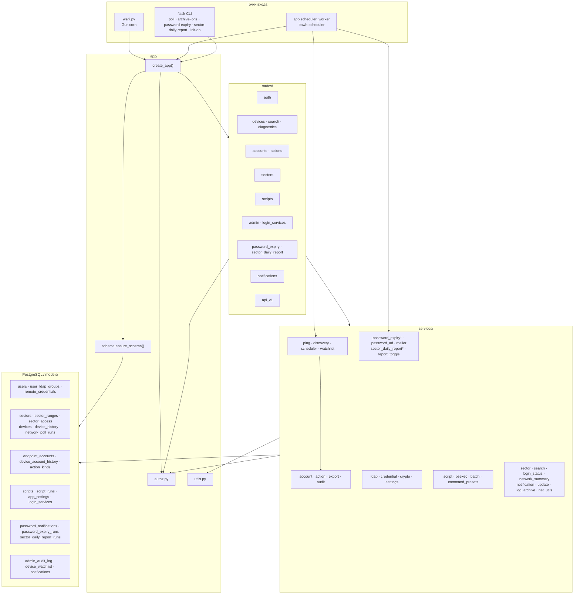
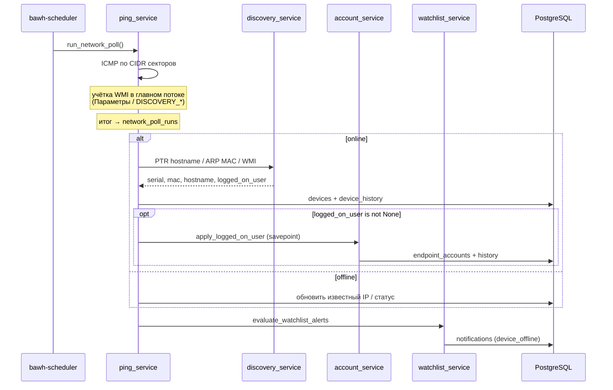

# Архитектура bAWH (актуально для v1.0.1)

> **Для ИИ и разработчиков:** это каноническая карта кода.
> Перед поиском по репозиторию прочитай файл целиком — здесь слои, точки входа,
> модели, сервисы, маршруты, authz, фоновые задачи и соглашения.
> Установка и ops — в [README.md](../README.md).

**Продукт:** внутренний веб-помощник администратора сети (карта устройств,
секторы/CIDR, ICMP+WMI опрос, диагностика, скрипты на Windows через PsExec,
LDAP-вход, отчёт по сроку паролей AD, watchlist и in-app уведомления).
Рассчитан на корпоративную LAN, не для публикации в интернет.

**Версия:** файл [`VERSION`](../VERSION) → `1.0.1` (читает `app/version.py`).

**Стек:** Flask 3 SSR (Jinja2) · SQLAlchemy 2 / Flask-SQLAlchemy · PostgreSQL
(prod; SQLite допустим локально) · Flask-Login · Flask-WTF CSRF · APScheduler
(отдельный процесс) · ldap3 · cryptography Fernet · pypsexec · impacket (WMI) ·
Gunicorn + Nginx · Bootstrap 5 (vendorized).

**Нет в репозитории:** Alembic / Flask-Migrate, Redis, Celery, WebSocket,
Telegram, S3, SPA-фреймворка, Pydantic, каталога `tests/`, pytest.

---

## 1. Слои и правило зависимости

```
HTTP / CLI / scheduler
        ↓
  routes/  (или scheduler_service / flask CLI)
        ↓
  services/   ← бизнес-логика; без Flask request/response
        ↓
  models/ + PostgreSQL
```

| Слой | Каталог / файл | Правило |
| --- | --- | --- |
| Маршруты | `app/routes/` | Только HTTP: форма → сервис → шаблон/JSON. **Не** пингуют и не ходят в LDAP/PsExec напрямую. |
| Сервисы | `app/services/` | Вся логика: опрос, LDAP, WMI, PsExec, УЗ, экспорт. Вызываются из веба, планировщика и CLI. |
| Модели | `app/models/` | Таблицы SQLAlchemy. Без HTML и сетевых вызовов. |
| Схема БД | `app/schema.py` | `ensure_schema()`: `create_all` для недостающих таблиц + seed `action_kinds`. |
| Authz | `app/authz.py` | Единственное место ACL секторов/устройств/script_runs и ролей. |
| Утилиты | `app/utils.py` | `utcnow` / `as_utc` / `ilike_pattern` / `clip` / пагинация. |

**Инвариант:** маршрут не делает side-effect сеть/LDAP; сервис не рендерит HTML.

---

## 2. Точки входа

| Точка | Файл / команда | Что делает |
| --- | --- | --- |
| Веб (prod) | `wsgi.py` → `create_app()` → Gunicorn `wsgi:app` | Только HTTP. Опрос здесь **запрещён**. |
| Веб (dev) | `python wsgi.py` (:8000) или `flask --app wsgi run` | То же. |
| Планировщик | `python -m app.scheduler_worker` | `create_app()` + `start_scheduler(app)`; HTTP не слушает. |
| Flask CLI | `flask --app wsgi …` | `poll`, `archive-logs`, `password-expiry [--dry-run]`, `sector-daily-report [--dry-run]`, `init-db`. |
| Docker | `Dockerfile` | Опциональный web-only образ; scheduler — отдельно. |

Фабрика: `app/__init__.py` → `create_app(config_name)`.

Порядок в `create_app`:

1. `load_dotenv()` → конфиг из `APP_CONFIG` / `CONFIGS` (`default` | `development` | `testing`)
2. `configure_logging`
3. `db` / `login_manager` / `csrf` (`app/extensions.py` — **без** migrate)
4. `import app.models` + `user_loader`
5. blueprints + error handlers 403/404/500
6. `register_commands` (CLI планировщика) + CLI `init-db`
7. `ensure_schema()` в app context
8. `GET /health` → `{"status": "ok"}` (без auth)
9. template filter `dt`, context `app_name`, shell context

Планировщик в `extensions` **не** создаётся — иначе каждый воркер Gunicorn запустил бы свой опрос.

---

## 3. Каталоги репозитория

```
bAWH/                          # на сервере = /opt/bawh
  VERSION                      # semver (1.0.1)
  wsgi.py                      # WSGI entry
  requirements.txt
  .env.example
  Dockerfile                   # опционально, только web
  README.md                    # установка и ops
  docs/ARCHITECTURE.md         # ← этот файл
  app/
    __init__.py                # create_app
    config.py
    extensions.py              # db, login_manager, csrf
    schema.py                  # ensure_schema (вместо Alembic)
    authz.py
    utils.py
    logging_config.py
    version.py
    run_display.py             # подписи статусов запусков для UI
    scheduler_worker.py
    models/
    services/
    routes/
    templates/
    static/                    # css/, js/, vendor/bootstrap/
  deploy/                      # Debian 12: systemd, nginx, install
  logs/                        # runtime (в gitignore содержимое)
```

---

## 4. Диаграмма слоёв



---

## 5. Схема БД (без Alembic)

Файл: `app/schema.py`.

```python
def ensure_schema() -> None:
    # 1) если в metadata есть таблицы, которых нет в БД → db.create_all()
    # 2) колонки из моделей, которых нет в существующих таблицах → ALTER TABLE ADD COLUMN
    # 3) если action_kinds пуст → seed_action_kinds() + commit
```

Вызывается при каждом старте `create_app` (web и scheduler).  
CLI `flask --app wsgi init-db` — то же (схема уже поднята фабрикой; команда печатает `database ready`).  
Установщик и self-update вызывают `flask init-db`.

**Таблицы:** `create_all` создаёт только **недостающие** таблицы. Новая сущность =
модель + экспорт в `models/__init__.py`; при деплое таблица появится на следующем старте.

**Колонки:** `ensure_schema` догоняет недостающие колонки через `ALTER TABLE … ADD COLUMN`
(с `DEFAULT` из `server_default` / скалярного `default`, иначе NOT NULL без default
добавляется как NULL). Это покрывает типичный случай «переустановили `/opt`, Postgres
не чистили» (например `users.is_viewer`). Не делает: rename/drop колонок, смену типа,
новые UNIQUE/FK/индексы на уже существующих колонках — для этого нужен ручной SQL
или пересоздание БД.

---

## 6. Модели (`app/models/`)

Импорт всех таблиц: `app/models/__init__.py`. Mixin: `TimestampMixin` в `base.py`.

| Модель | Таблица | Файл | Назначение |
| --- | --- | --- | --- |
| `User`, `UserLdapGroup` | `users`, `user_ldap_groups` | `user.py` | Операторы сайта после LDAP. Флаги: `is_admin`, `is_viewer`, `is_operator`, `is_password_viewer`. Группы — для `sector_access`. |
| `Sector`, `SectorRange`, `SectorAccess` | `sectors`, `sector_ranges`, `sector_access` | `sector.py` | Подсети (CIDR) и ACL (subject = username или LDAP group CN). |
| `Device`, `DeviceHistory` | `devices`, `device_history` | `device.py` | Машины + журнал опросов. Идентичность: `serial_number` (WMI), иначе hostname; IP — последний адрес; `current_account_id` — кто за ПК. |
| `NetworkPollRun` | `network_poll_runs` | `poll_run.py` | Журнал полных прогонов опроса. |
| `EndpointAccount`, `DeviceAccountHistory` | `endpoint_accounts`, `device_account_history` | `account.py` | УЗ на конечных точках (**не** путать с `users`). |
| `ActionKind` | `action_kinds` | `action.py` | Справочник типов (`ACTION_KIND_SEED` / `seed_action_kinds`). |
| `Script`, `ScriptRun` | `scripts`, `script_runs` | `script.py` | Библиотека и журнал запусков. У скрипта: `run_as`, `is_published`. У run: `run_type`, `batch_id`, статус. |
| `AppSetting`, `RemoteCredential` | `app_settings`, `remote_credentials` | `setting.py` | KV-настройки; per-user Fernet-шифротекст PsExec/пароля входа. |
| `PasswordNotification`, `PasswordExpiryRun` | `password_notifications`, `password_expiry_runs` | `password_expiry.py` | Письма о сроке пароля + снимки прогонов. |
| `SectorDailyReportRun` | `sector_daily_report_runs` | `sector_daily_report.py` | Снимки ежедневного отчёта активных устройств по секторам. |
| `LoginService` | `login_services` | `login_service.py` | Сервисы для блока доступности на `/login`. |
| `AdminAuditLog` | `admin_audit_log` | `audit.py` | Журнал админ-действий. |
| `DeviceWatchlist` | `device_watchlist` | `watchlist.py` | Подписка пользователя на offline устройства. |
| `Notification` | `notifications` | `notification.py` | In-app колокольчик: `device_offline`, `script_failed`, `poll_error`. |

Не таблицы (enum/константы): `DeviceStatus`, `SessionType`, `RunType`, `RunStatus`,
`RunAs`, `NotificationKind`, `ActionKindCode`.

Seed коды действий: `poll`, `ping`, `tracert`, `command`, `script`, `account_sighting`.

### Кто пишет / кто читает

| Сущность | Таблица | Пишет | Читает |
| --- | --- | --- | --- |
| Оператор сайта | `users` | `ldap_service` | auth, authz |
| УЗ на ПК | `endpoint_accounts` | `account_service` | `/accounts`, карточка устройства |
| Появление УЗ | `device_account_history` | `account_service` | `/actions`, вкладка accounts |
| Типы действий | `action_kinds` | `ensure_schema` / seed | `/actions` |
| Запуски | `script_runs` | `script_service` | `/scripts/runs`, `/actions` |
| Опросы | `device_history` | `ping_service` | вкладка polls |
| Прогоны опроса | `network_poll_runs` | `ping_service.run_network_poll` | `/admin/settings` |
| Аудит админа | `admin_audit_log` | `audit_service` | `/admin/audit` |
| Watchlist | `device_watchlist` | `watchlist_service` | карточка, post-poll |
| Уведомления | `notifications` | `notification_service` / watchlist | `/api/notifications` |

---

## 7. Сервисы (`app/services/`)

### Сеть и опрос

| Модуль | Роль |
| --- | --- |
| `net_utils.py` | `parse_range`, `expand_ranges`, `normalize_mac`, `assert_host_or_ipv4`, `resolve_to_ipv4` |
| `ping_service.py` | ICMP; `run_network_poll` (mutex + журнал) → `poll_all_sectors`; `ping_host` / `trace_host`; ThreadPoolExecutor |
| `discovery_service.py` | reverse DNS, ARP MAC, WMI (impacket): serial / MAC / hostname / logged_on_user. Имя: PTR, иначе WMI `Name`/`DNSHostName`. Учётка: Параметры или `DISCOVERY_*` |
| `scheduler_service.py` | APScheduler jobs + Flask CLI |
| `network_summary_service.py` | сводка карты + health планировщика |
| `watchlist_service.py` | CRUD watch; `evaluate_watchlist_alerts` после опроса |

### Идентичность и секреты

| Модуль | Роль |
| --- | --- |
| `ldap_service.py` | bind/search, mapping LDAP-групп → роли, `upsert_local_user` |
| `crypto_service.py` | Fernet `encrypt` / `decrypt` |
| `credential_service.py` | `get_remote_admin_credentials`, `save_remote_admin_credentials`, `remember_login_password` |
| `settings_service.py` | интервал опроса, WMI creds, update-sudo в `app_settings` |

### УЗ, действия, экспорт

| Модуль | Роль |
| --- | --- |
| `account_service.py` | NetBIOS-нормализация домена, upsert УЗ, sightings, ACL-списки |
| `action_service.py` | лента действий (script_runs + account history) с authz как у run_detail |
| `export_service.py` | CSV (accounts, actions, poll runs) |
| `audit_service.py` | запись/чтение `admin_audit_log` |

### Удалённый запуск и скрипты

| Модуль | Роль |
| --- | --- |
| `psexec_service.py` | pypsexec-сессии, cancel/close |
| `script_service.py` | CRUD/тело скриптов; enqueue на ThreadPoolExecutor в веб-процессе |
| `batch_service.py` | bulk ping/script + статус batch |
| `command_presets.py` | статические пресеты команд |

### Пароли AD

| Модуль | Роль |
| --- | --- |
| `password_expiry_service.py` | оркестрация прогона |
| `password_ad_client.py` | LDAP: пользователи и days-left |
| `password_mailer.py` | SMTP |
| `password_expiry_settings.py` | настройки UI/DB + fallback на `.env` |
| `password_notification_tracker.py` | дедуп писем |
| `password_report_builder.py` | отчёт для админа |
| `report_toggle_service.py` | тумблер расписания отчётов + ensure scheduler |
| `systemd_service.py` | `systemctl` start/enable/restart через sudo-учётку |

### Отчёт по секторам

| Модуль | Роль |
| --- | --- |
| `sector_daily_report_service.py` | оркестрация: active/known за прошедший день |
| `sector_daily_report_settings.py` | cron / recipients / schedule_enabled в `app_settings` |

### Прочее

| Модуль | Роль |
| --- | --- |
| `sector_service.py` | CRUD секторов, ranges, access |
| `search_service.py` | поиск по IP / MAC / hostname / serial |
| `login_service_status.py` | CRUD сервисов экрана входа + ICMP status |
| `notification_service.py` | in-app уведомления |
| `log_archive_service.py` | месячный tar.gz ротированных логов |
| `update_service.py` | git pull → backup → pip → `flask init-db` → systemd restart |

---

## 8. Маршруты (`app/routes/`)

Регистрация: `_register_blueprints` в `app/__init__.py`.

### Auth — `auth.py`

| Method | Path | Примечание |
| --- | --- | --- |
| GET/POST | `/login` | LDAP; шифрует пароль входа для fallback PsExec |
| POST | `/logout` | `@login_required` |

### Devices — `devices.py` (без prefix)

| Method | Path | Примечание |
| --- | --- | --- |
| GET | `/` | Карта сети |
| GET | `/map/status` | JSON статуса карты |
| POST | `/api/map/bulk/ping` | Bulk ping (нужны права diagnostics) |
| POST | `/api/map/bulk/script` | Bulk script (operator + published) |
| GET | `/api/batches/<batch_id>` | Статус batch |
| GET | `/api/network/summary` | Сводка сети |
| GET | `/api/command-presets` | Пресеты (**admin**) |
| GET | `/devices/<id>` | Карточка: overview / accounts / commands / polls |
| POST | `/devices/<id>/watch`, `/unwatch` | Watchlist |
| POST | `/devices/<id>/scripts/run` | Скрипт с карточки |

### Diagnostics — `diagnostics.py`

| Method | Path | Auth |
| --- | --- | --- |
| POST | `/devices/<id>/ping` | diagnostics |
| POST | `/devices/<id>/tracert` | diagnostics |
| POST | `/devices/<id>/command` | **admin** |

### Sectors — prefix `/sectors`

CRUD: list, new, create, detail, edit, update, delete (mutating — `admin_required`).

### Search — `search.py`

| GET | `/search` | редирект на карту |
| GET | `/search/api`, `/search/suggest` | JSON suggest |

### Scripts — prefix `/scripts`

CRUD (admin); list/run (operator + `is_published`); `/runs/<id>`, `/status`, cancel, close-session; `/batches/<batch_id>`.

### Accounts — prefix `/accounts`

List, `export.csv`, detail (только видимые по ACL).

### Actions — prefix `/actions`

Лента + `export.csv`.

### Admin — prefix `/admin` (всё `admin_required`)

| Method | Path |
| --- | --- |
| GET/POST | `/admin/settings` |
| GET | `/admin/poll-runs/export.csv` |
| POST | `/admin/poll-run` |
| GET/POST | `/admin/updates` |
| GET | `/admin/audit` |

### Password expiry — prefix `/password-expiry`

| Method | Path | Auth |
| --- | --- | --- |
| GET | `/` | `password_viewer` |
| POST | `/toggle` | admin — тумблер рассылки + ensure `bawh-scheduler` |
| GET/POST | `/settings`, POST `/run`, `/pause`, `/notify` | admin |

### Sector daily report — prefix `/sector-daily-report`

| Method | Path | Auth |
| --- | --- | --- |
| GET | `/` | admin — дашборд + тумблер сервиса |
| POST | `/toggle` | admin — тумблер рассылки + ensure `bawh-scheduler` |
| GET/POST | `/settings`, POST `/run` | admin |

### Login services — `login_services.py`

CRUD `/login-services/…` (admin); публичный `GET /api/login-services/status`.

### Notifications — `notifications.py`

| GET | `/api/notifications` |
| POST | `/api/notifications/read` |

### API v1 — prefix `/api/v1` (`api_v1.py`)

Тонкие alias на legacy-handlers:

- `GET /api/v1/network/summary`
- `GET /api/v1/command-presets`
- `GET /api/v1/map/status`
- `GET /api/v1/batches/<batch_id>`
- `GET /api/v1/notifications`
- `GET /api/v1/search/suggest`
- `GET /api/v1/health` → `{"status":"ok"}`

### Открытые без логина

- `GET /health`
- `GET /api/v1/health`
- `GET /api/login-services/status`
- `GET/POST /login`

---

## 9. Авторизация и безопасность

### Вход

`POST /login` → `ldap_service.authenticate` → `upsert_local_user` (роли + группы) →
опционально `remember_login_password` (Fernet) → `login_user` → cookie-сессия.

### Сессия / CSRF

- Flask-Login cookie: `HttpOnly`, `SameSite=Lax`, опционально `Secure` (`SESSION_COOKIE_SECURE`)
- CSRF глобально (Flask-WTF); в `TestingConfig` выключен
- Open-redirect guard: только относительные `next`

### Authz (`app/authz.py`)

| Роль | LDAP env | Флаг `User` | Смысл |
| --- | --- | --- | --- |
| `admin` | `LDAP_ADMIN_GROUP` | `is_admin` | Всё (`user_has_role` считает admin обладателем любой роли) |
| `viewer` | `LDAP_VIEWER_GROUP` | `is_viewer` | Чтение карты/устройств в рамках `sector_access`; **без** ping/скриптов |
| `operator` | `LDAP_OPERATOR_GROUP` | `is_operator` | Ping/tracert + запуск **опубликованных** скриптов; CRUD скриптов — только admin |
| `password_viewer` | `LDAP_PASSWORD_VIEWER_GROUP` | `is_password_viewer` | Отчёт паролей AD; SMTP/settings — admin |

Базовые правила:

- Admin видит всё.
- Non-admin: сектора/устройства по `sector_access` (username или CN группы из `user_ldap_groups`).
- `script_runs`: admin, автор, или доступное устройство; orphan без автора скрыт (`user_can_see_script_run`).
- UI-скрытие меню **не** защита: каждый mutating endpoint проверяет на сервере.

Хелперы: `admin_required`, `user_has_role`, `user_can_run_scripts`, `user_can_run_script`,
`user_can_run_diagnostics`, `user_can_view_password_expiry`, `accessible_sector_ids`,
`user_can_access_device`, `get_visible_device_or_404`, `filter_accessible_devices`,
`user_can_see_script_run`.

### Секреты

| Что | Где |
| --- | --- |
| `SECRET_KEY`, `FERNET_KEY`, LDAP/SMTP/DB пароли | только `.env` / EnvironmentFile |
| Пароли PsExec / пароль входа | Fernet ciphertext в `remote_credentials` |
| Учётка WMI discovery | `.env` `DISCOVERY_*` или Параметры (`settings_service`) |

Порядок учётки PsExec (`get_remote_admin_credentials(user_id)`):

1. Заполненные username+password в строке пользователя (`/admin/settings`)
2. Иначе имя входа + `LDAP_DOMAIN` + зашифрованный пароль последнего LDAP-входа

---

## 10. Фоновые задачи

### Процесс `bawh-scheduler` (APScheduler)

| Job | Триггер | Действие |
| --- | --- | --- |
| `poll-devices` | Interval из `app_settings` / `POLL_INTERVAL_SECONDS` | `run_network_poll` |
| `archive-logs` | daily ~00:20 UTC | `log_archive_service` |
| `password-expiry` | cron из настроек модуля | `run_password_expiry` (если включено) |
| `sector-daily-report` | cron из настроек модуля (default `0 7 * * *`) | `run_sector_daily_report` (если включено) |

Интервал опроса и cron отчётов подхватываются без перезапуска процесса.
Тумблер «Сервис отчётов» на UI включает job и при необходимости поднимает
systemd-unit `bawh-scheduler` (sudo-учётка: Параметры → Управление службами).

### Внутри веб-процесса

| Механизм | Где | Зачем |
| --- | --- | --- |
| `ThreadPoolExecutor` | `ping_service` | параллельный ICMP+discovery; запись в БД — в главном потоке |
| `ThreadPoolExecutor` | `script_service.enqueue_run` | фоновый PsExec/ping/tracert; UI поллит `/scripts/runs/<id>/status` (~1.5 с, `run_log.js`) |

**Нет** WebSocket / SSE / Celery / общей очереди сообщений.

---

## 11. Ключевые потоки данных

### A. HTTP lifecycle

```
Nginx → Gunicorn (wsgi:app)
  → session / CSRF / Flask-Login
  → blueprint (@login_required / @admin_required / authz)
  → service (DB / LDAP / ping / psexec)
  → Jinja template или jsonify
```

### B. Опрос сети



### C. Скрипт / команда

Форма/API → authz → `script_service.start_run(s)` (pending commit) →
ThreadPool `execute_run` → `psexec_service` или локальный ping/tracert →
обновление `script_runs` → JS поллит status. При ошибке — возможна `Notification` (`script_failed`).

### D. Password expiry

Scheduler cron / CLI / UI → `run_password_expiry` → LDAP fetch → classify →
SMTP → `password_expiry_runs` + `password_notifications`.

### D2. Sector daily report

Scheduler cron / CLI / UI → `run_sector_daily_report` → distinct online
`device_history` за прошедший локальный день по секторам → SMTP →
`sector_daily_report_runs`.

### E. Self-update

Admin UI → `update_service`: backup → git → pip → `flask init-db` →
опциональный restart `bawh-web` + `bawh-scheduler` (sudoers).

---

## 12. Соглашения по домену и коду

- **Домен УЗ** = NetBIOS upper-case (первая метка DNS/UPN): `CORP\alice` и `alice@corp.local` — одна запись.
- **Hostname:** сначала PTR (`socket.gethostbyaddr`); если записи нет — `Win32_ComputerSystem.DNSHostName` / `Name` из того же WMI-захода.
- **WMI UserName:** `None` в probe — WMI не вызывали/упал (текущую УЗ **не** трогаем); `""` — никто не залогинен.
- **ILIKE:** только через `utils.ilike_pattern` (экранирование `%`/`_`).
- **Время:** всегда timezone-aware UTC (`utils.utcnow` / `as_utc`); в шаблонах фильтр `dt`.
- **Пустые адреса** в `devices` опрос не создаёт.
- **Селект = execute:** списки устройств/секторов в формах должны совпадать с ACL execute.
- Новый код: маршрут тонкий; логика в сервисе; новая таблица — модель + `ensure_schema` на старте.

---

## 13. Frontend

**Шаблоны** (`app/templates/`): каркас `base.html` (навигация: карта, действия, УЗ,
скрипты, пароли AD, отчёт по секторам, настройки). Домены: `accounts/`, `actions/`,
`admin/`, `auth/`, `devices/`, `email/`, `errors/`, `layouts/`, `login_services/`,
`macros/`, `password_expiry/`, `scripts/`, `sector_daily_report/`, `sectors/`.

**Static:**

| Путь | Назначение |
| --- | --- |
| `static/css/app.css` | Стили |
| `static/js/http.js` | общий fetch/CSRF helper |
| `static/js/map.js` | карта сети |
| `static/js/search.js` | suggest |
| `static/js/batch.js` | bulk операции |
| `static/js/notifications.js` | колокольчик |
| `static/js/run_log.js` | поллинг лога запуска |
| `static/js/login_status.js` | статус сервисов на `/login` |
| `static/vendor/bootstrap/` | Bootstrap 5 offline (air-gap) |

---

## 14. Конфигурация (обзор)

Источник: `.env` / `EnvironmentFile` → `app/config.py`. Полный список — `.env.example`.

| Группа | Переменные |
| --- | --- |
| App | `APP_CONFIG`, `SECRET_KEY`, `APP_NAME`, `LOG_*`, `LOG_ARCHIVE_*` |
| DB | `DATABASE_URL` |
| LDAP | `LDAP_HOST/PORT/USE_SSL/BASE_DN/BIND_*/USER_FILTER/ADMIN_GROUP/VIEWER_GROUP/OPERATOR_GROUP/PASSWORD_VIEWER_GROUP/DOMAIN` |
| SMTP | `SMTP_HOST/PORT/USE_STARTTLS/FROM/USER/PASSWORD` (UI модуля паролей может переопределить) |
| Poll | `POLL_INTERVAL_SECONDS`, `MIN_CIDR_PREFIX`, `MAX_HOSTS_PER_POLL`, `DISCOVERY_USERNAME/PASSWORD/DOMAIN` |
| Crypto | `FERNET_KEY` |
| Scripts | `SCRIPT_LIBRARY_DIR` |
| Updates | `GIT_REMOTE_URL`, `GIT_BRANCH`, `UPDATE_BACKUP_KEEP`, `UPDATE_RESTART`, `UPDATE_SUDO_USER` |
| Cookies | `SESSION_COOKIE_SECURE` |

Также в коде: `PROJECT_ROOT`, `MAX_LOG_CHARS`, `MAX_REMOTE_COMMAND_CHARS`.

---

## 15. Деплой

Основной путь: **Debian 12 + systemd + Nginx** (`deploy/`), каталог `/opt/bawh`.

| Артефакт | Роль |
| --- | --- |
| `deploy/install-debian12.sh` | Установка одной командой → PG, venv, `flask init-db`, nginx, systemd |
| `deploy/bawh-web.service` | Gunicorn `127.0.0.1:8000`, `EnvironmentFile=/opt/bawh/.env` |
| `deploy/bawh-scheduler.service` | `python -m app.scheduler_worker` |
| `deploy/nginx-bawh.conf` | :80 → gunicorn |
| `deploy/bawh-update.sudoers` | passwordless restart + start/enable `bawh-scheduler` |
| `deploy/logrotate-bawh` | logrotate |
| `Dockerfile` | опционально, только web |

Два процесса обязательны: **web** и **scheduler**. Один `.env` на оба (общий `FERNET_KEY`).

---

## 16. Внешние интеграции

| Интеграция | Как | Где |
| --- | --- | --- |
| AD / LDAP | ldap3 bind+search | `ldap_service`, `password_ad_client` |
| SMTP | mailer | `password_mailer` |
| ICMP / traceroute | OS `ping` / `traceroute` | `ping_service` |
| Windows WMI | impacket | `discovery_service` |
| Windows remote | pypsexec (SMB/ADMIN$) | `psexec_service` |
| Git HTTPS | update check / pull | `update_service` |
| systemd | restart после update | `update_service`, sudoers |

---

## 17. Карта «куда смотреть»

| Задача | С чего начать |
| --- | --- |
| Новый HTTP endpoint | `app/routes/<domain>.py` → сервис → шаблон; blueprint уже в `__init__` |
| Права доступа | `app/authz.py` + флаги `User` + LDAP groups в `ldap_service` |
| Опрос / ICMP / WMI | `ping_service` → `discovery_service` → `account_service` |
| Карта сети UI | `routes/devices.py`, `templates/devices/map.html`, `static/js/map.js`, `network_summary_service` |
| Скрипты / PsExec | `script_service`, `psexec_service`, `routes/scripts.py`, `credential_service` |
| Bulk с карты | `batch_service`, `routes/devices.py` bulk API, `static/js/batch.js` |
| УЗ на ПК | `account_service`, `models/account.py`, `routes/accounts.py` |
| Пароли AD | `password_expiry_service` + `password_*`, `routes/password_expiry.py` |
| Отчёт по секторам | `sector_daily_report_service` + settings, `routes/sector_daily_report.py` |
| Уведомления / watchlist | `notification_service`, `watchlist_service`, `routes/notifications.py` |
| Настройки / опрос вручную | `routes/admin.py`, `settings_service` |
| Аудит админа | `audit_service`, `/admin/audit` |
| Новая таблица | модель в `models/` → `__all__` в `models/__init__.py` → `ensure_schema` на старте |
| Конфиг / env | `config.py` + `.env.example` |
| Деплой unit | `deploy/*` |
| Версия релиза | корневой `VERSION`, `app/version.py` |

---

## 18. Связанные документы

| Документ | Когда нужен |
| --- | --- |
| [README.md](../README.md) | Установка на Debian, минимальный `.env`, службы, обновление |
| [`.env.example`](../.env.example) | Полный список переменных окружения |

---

*Обновляйте этот файл при смене слоёв, схемы БД, новых blueprints/сервисов/ролей или инвариантов домена.*
